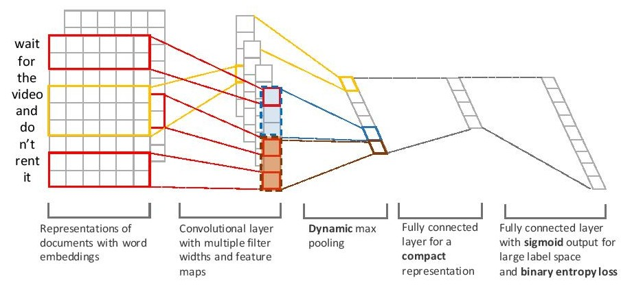

# XML-CNN
  Pytorch implementation of the paper [Deep Learning for Extreme Multi-label Text Classification](http://nyc.lti.cs.cmu.edu/yiming/Publications/jliu-sigir17.pdf) with dynamic pooling

## Dependencies

* NLTK (stopwords)
* Pytorch >= 0.3.1
* Gensim
* Matplotlib



Directory Structure:

```
+-- code
|   +-- cnn_test.py  
|   +-- cnn_train.py
|   +-- header.py
|   +-- main.py
|   +-- models
|   |   +-- classifier.py
|   |   +-- cnn_encoder.py
|   |   +-- embedding_layer.py
|   |   +-- header.py
|   |   +-- xmlCNN.py
|   +-- precision_k.py
|   +-- score_matrix.mat
|   +-- test_manik.m
+-- datasets
|   +-- Folder where datasets need to be kept
+-- embedding_weights
+-- saved_models
|   +-- Directory created by default where models are saved
+-- utils
|   +-- data_dive.py
|   +-- data_helpers.py
|   +-- fiddle_clusters.py
|   +-- futils.py
|   +-- loss.py
|   +-- process_eurlex.py
|   +-- w2v.py
+-- README.md
```
Glove embeddings are needed by default as pre-training for the model. They can be download from [here](https://nlp.stanford.edu/data/glove.6B.zip) and placed in ```embedding_weights``` directory. The Default embedding dimension is 300 with 6 Billion (6B) tokens. Otherwise you can set --model_variation = 0 for starting from scratch.

Sample dataset RCV can be downloaded from [here](http://cse.iitk.ac.in/users/siddsax/rcv.p). Trained model on RCV1 can be downloaded from below.

[Trained model](http://cse.iitk.ac.in/users/siddsax/rcvSaved.pt)

Precision Scores

| 1 | 2 | 3 | 4 | 5 | 
|---|---|---|---|---|
|0.96 | 0.8848 | 0.7809 | 0.6436 | 0.5457 |

Note: The scores are slighltly higher as the tested dataset is part of the full test dataset.

Procedure to train and test the model is as follows. The code by default doesn't plot graphs. Though that can be enabled wth a visdom server running [[Visdom](https://github.com/facebookresearch/visdom)] and turing on flag --d
```bash
python main.py # train a model
python main.py --mn=rcv # train a model and save in directory rcv [inside saved_models]
```
This will create multiple files inside the folder ```saved_models/rcv``` in the above case. Checkpoints are saved after every 
```save_step``` epochs, this can be changed with ``--ss`` option in command line. Also a checkpoint is made according to best test precision@1 score and best training batch precision@1.

```bash
python main.py --lm=$DESTINATION OF SAVED MODEL # This resumes trainign from the given checkpoint
```

In order to test the model run
```bash
python main.py --lm=$DESTINATION OF SAVED MODEL --tr=0 
```

This will first print the training error and then the test error while also saving a score_matrix.mat in the folder the model is loaded that can be used to run test scripts from [here](https://drive.google.com/open?id=0B3lPMIHmG6vGN0hSQjFJUHZ0YTg)
  
